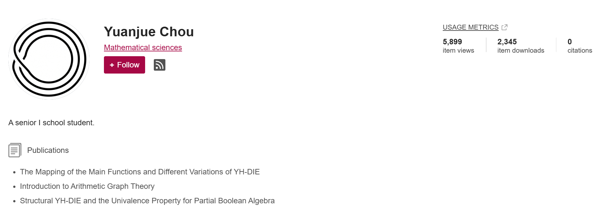

# Informal Notes on Mathematics

这是一个用于存放个人自学数学过程中记录的笔记和资料的项目。

此项目原本通过FigShare发布，后来不再更新。DOI：[10.6084/m9.figshare.c.6094833.v7](https://doi.org/10.6084/m9.figshare.c.6094833.v7)

截止至2025.9.18 9:00，此项目在FigShare的总浏览量为`5,899`次，总下载量为`2345`次。

## 项目结构

项目按年份和类型组织，主要包含以下内容：

### 笔记文件

  笔记文件命名格式为 `N-YYYYMMDD.pdf`，其中 `YYYYMMDD` 表示笔记创建的日期。

### 生成的Markdown文件

  笔记文件通过项目[ChouYuanjue/PDF_Summary_Tool](https://github.com/ChouYuanjue/PDF_Summary_Tool)转化为Markdown格式的文件，命名格式为 `N-YYYYMMDD.md`。每份笔记对应两个markdown文件，分别采用不同的转换逻辑自动生成。其中，`md_full-page`文件夹存储的是通过整页传输方法处理的结果，`md_crop-region`文件夹存储的是通过分区方法处理的结果。

### 生成的YAML文件

  每个Markdown文件都对应一个YAML文件，命名格式为 `N-YYYYMMDD.yaml`。YAML文件包含了笔记的内容概括、关键词等信息。同样使用[ChouYuanjue/PDF_Summary_Tool](https://github.com/ChouYuanjue/PDF_Summary_Tool)项目自动生成。

### 整合笔记的LaTeX文件
 - `inm.tex` - 主LaTeX源文件

  编译后生成整合所有笔记的PDF文件，包含目录。

### 论文
- `papers/` - 曾经为了练习TeX而写的一些论文，主要是娱乐向和玩梗，不具有实际科学意义。

### 辅助工具
- `list.py` - 自动生成PDF文件列表的Python脚本
- `commits.py` - Git提交相关的辅助脚本

## 项目目的

这个项目旨在：
1. 系统地记录个人数学学习过程中的思考、推导和理解
2. 整理和归档数学学习资料，便于复习和查找
3. 提供一个结构化的方式来跟踪数学学习进度
4. 对笔记进行数字化的尝试

## 使用方法

### 查看单篇笔记
1. 进入对应年份的文件夹（如`2022/`）
2. 直接打开文件名格式为`N-YYYYMMDD.pdf`的文件即可查看特定日期的笔记内容

### 生成完整笔记合集
1. 确保已安装Python环境
2. 执行`python list.py`脚本自动生成最新的笔记列表
3. 使用LaTeX编译工具（如TeX Live、MiKTeX等）编译`inm.tex`文件
4. 获取包含所有笔记内容及目录的完整PDF文档

### 查看数字化笔记
1. 进入`md_full-page/`或`md_crop-region/`文件夹
2. 打开对应的Markdown文件查看数字化版本的笔记内容
3. 每份PDF笔记对应两个Markdown文件，分别采用不同的转换逻辑生成

### 查看元数据信息
1. 在各年份文件夹中找到与PDF同名的YAML文件
2. 打开YAML文件查看笔记的内容概括、关键词等元数据信息

## 注意事项
- 此项目为个人学习记录，内容可能包含错误或不完整的理解
- 请勿将此项目中的内容作为正式学习资料使用

## License
[MIT License](LICENSE)
